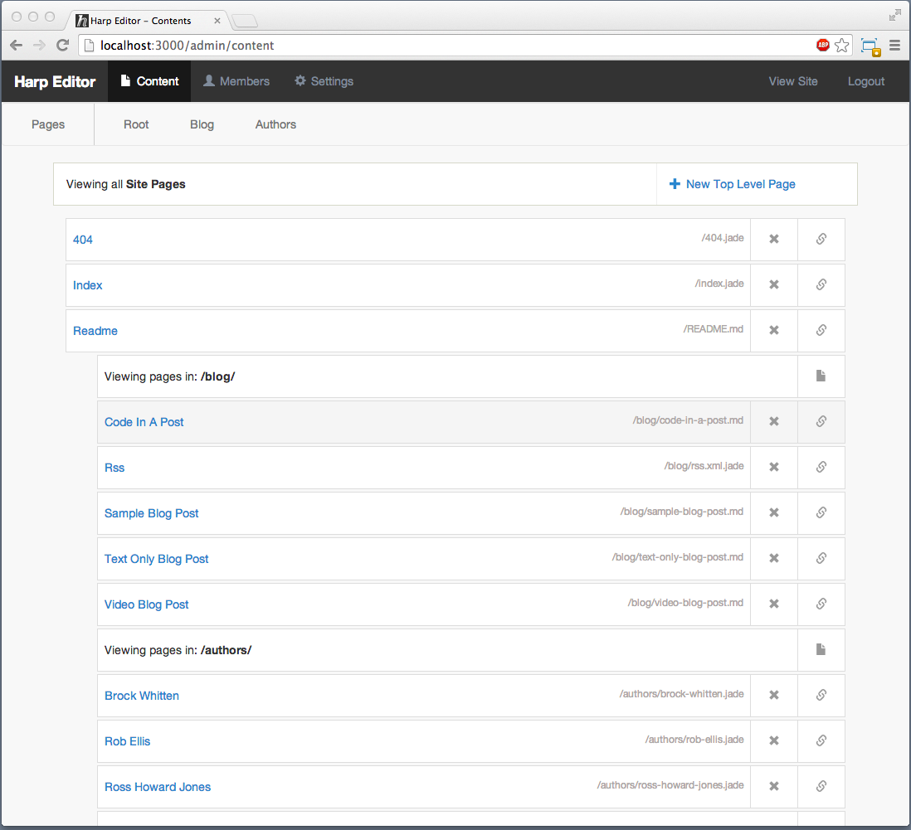

# Harp Editor

Adds Editor and CMS like Admin interface on top of any Harp Boilerplates.
Built on top of Harp web server and uses best practices.

	$ npm install
	$ node server

Run tests - Edit /test/config.json
	
	$ npm test

## Screenshot

## Features
- User Management and Auth
- Admin Dashboard
- Decorates Editor
- Saves Locally
- Provides File History

## Setup
1. Clone or download Repo
2. Install Deplenancies: npm install
3. Edit config.json to point to your existing boilerplate
4. Start Server: node server.js
5. Visit Server at: http://localhost:3000

## Roadmap

### MVP TODOS aka current issues
- Edit Entries
- Add CLI to init (replace config.boilerplate with CLI args)
- Member needs `admin`

### MDP TODOS
- Docs
- Better Content Edit Expierence
- Convert Page to Entry - Add folder and index file from slug name
- Add Domain Settings for Harp Platform
- Log activity
- Sorting Entries
- Safe Delete
- First Launch expierence
- Deploy to Harp Platform
- Workflow content management
- Templates and guidlines
- Image upload
- delete _data files if you remove the last entry

# License (MIT)

Copyright (c) 2013 Chloi Inc.

Permission is hereby granted, free of charge, to any person obtaining a copy
of this software and associated documentation files (the "Software"), to deal
in the Software without restriction, including without limitation the rights
to use, copy, modify, merge, publish, distribute, sublicense, and/or sell
copies of the Software, and to permit persons to whom the Software is
furnished to do so, subject to the following conditions:

The above copyright notice and this permission notice shall be included in
all copies or substantial portions of the Software.

THE SOFTWARE IS PROVIDED "AS IS", WITHOUT WARRANTY OF ANY KIND, EXPRESS OR
IMPLIED, INCLUDING BUT NOT LIMITED TO THE WARRANTIES OF MERCHANTABILITY,
FITNESS FOR A PARTICULAR PURPOSE AND NONINFRINGEMENT. IN NO EVENT SHALL THE
AUTHORS OR COPYRIGHT HOLDERS BE LIABLE FOR ANY CLAIM, DAMAGES OR OTHER
LIABILITY, WHETHER IN AN ACTION OF CONTRACT, TORT OR OTHERWISE, ARISING FROM,
OUT OF OR IN CONNECTION WITH THE SOFTWARE OR THE USE OR OTHER DEALINGS IN
THE SOFTWARE.
